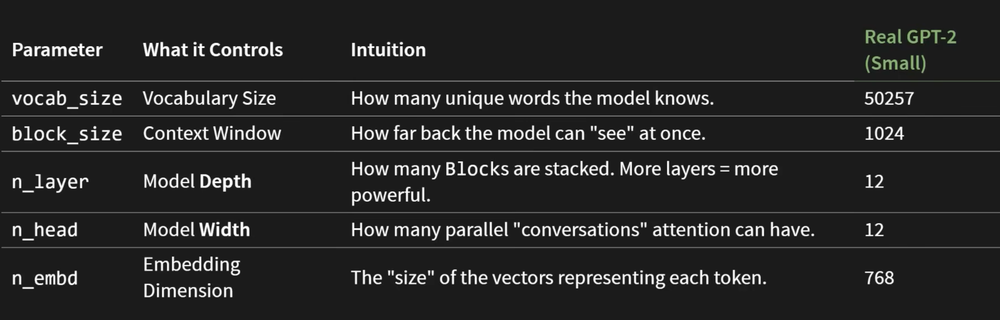

# GPT from Scratch

My own implementation of Andrej Karpathy's video [Let's build GPT: from scratch, in code, spelled out](https://www.youtube.com/watch?v=kCc8FmEb1nY).

It's a character-level GPT trained on Tiny Shakespeare that learns to generate Shakespeare-like text. I built it one piece at a time and tracked the loss after each step.

A transformer turns each token into an embedding, then uses self-attention so every token can look at the tokens before it and pick up context. Stacked blocks of attention and feed-forward layers refine that context until the model predicts the next token.

## Files

- `Bigram.py` — baseline bigram language model
- `gpt.py` — the full transformer model
- `gpt_from_scratch.ipynb` — notebook walking through the build
- `Residual Network .ipynb` — residual network experiments (uses `names.txt`)
- `input.txt` — Tiny Shakespeare dataset
- `names.txt` — names dataset

## Run

Uses [uv](https://docs.astral.sh/uv/):

```bash
uv sync
uv run gpt.py
```

For the notebooks, select the `.venv` kernel in your editor.

## Results

| Stage | Iters / LR | Train @2700 | Val @2700 | Train @4800 | Val @4800 |
|---|---|---|---|---|---|
| Bigram (no attention) | 3000 / 1e-2 | 2.5040 | 2.5114 | – | – |
| One self-attention head | 3000 / 1e-2 | 2.4033 | 2.4352 | – | – |
| Multi-head attention | 3000 / 1e-2 | 2.2168 | 2.2792 | – | – |
| + Feed-forward | 3000 / 1e-2 | 2.1564 | 2.2431 | – | – |
| 4 residual blocks, no projection | 5000 / 1e-3 | 2.1103 | 2.1615 | 2.0196 | 2.0901 |
| 4 residual blocks, with projection | 5000 / 1e-3 | 2.0907 | 2.1384 | 1.9718 | 2.0651 |
| LayerNorm (pre-norm) | 5000 / 1e-3 | 2.0717 | 2.1273 | 1.9677 | 2.0710 |
| LayerNorm (post-norm) | 5000 / 1e-3 | 2.0782 | 2.1310 | 1.9742 | 2.0708 |
| Dropout 10% | 5000 / 1e-3 | 2.1308 | 2.1718 | 2.0522 | 2.1238 |

## GPT Config



## Lessons Learned

- `nn.Embedding` is nothing more than a lookup table: each token gets a vector so it has a semantic meaning the computer can work with.
- Tokens are not just words; they can be characters, subwords or whole words, depending on the vocab size.
- Vocab size decides how byte pair encoding splits text. Small vocab forces single characters (`u`, `n`, `b`...), medium gives subwords (`un`, `bel`, `iev`...), and a big vocab can keep `unbelievable` as one token.
- BPE tries to represent the whole text with as few tokens as possible. With a large vocab it can get lazy and make each word a token; with a small one it has to find the most repeating patterns.
- Token length is how many characters a token holds; sequence length is how many tokens the whole input takes.
- As vocab size increases, sequence length decreases, and the opposite is also true. It is a trade off.
- `block_size` is how many tokens the model can see at once (its context). Fewer tokens per sentence means you don't reach `block_size` easily. Think of garbage bags: the bigger the bag, the more you collect at once.
- The chain: vocab size → token length → sequence length ≤ block size. Embedding dimension (`n_embd`) is separate and controls representation capacity.
- Token embeddings alone are not enough because they are static and context free: the same word has the same embedding no matter where it is in the sentence.
- Positional embeddings (`nn.Embedding(block_size, n_embd)`) are learned per position, not per token, only up to `block_size`, and get added to the token embeddings in the same dimension space.
